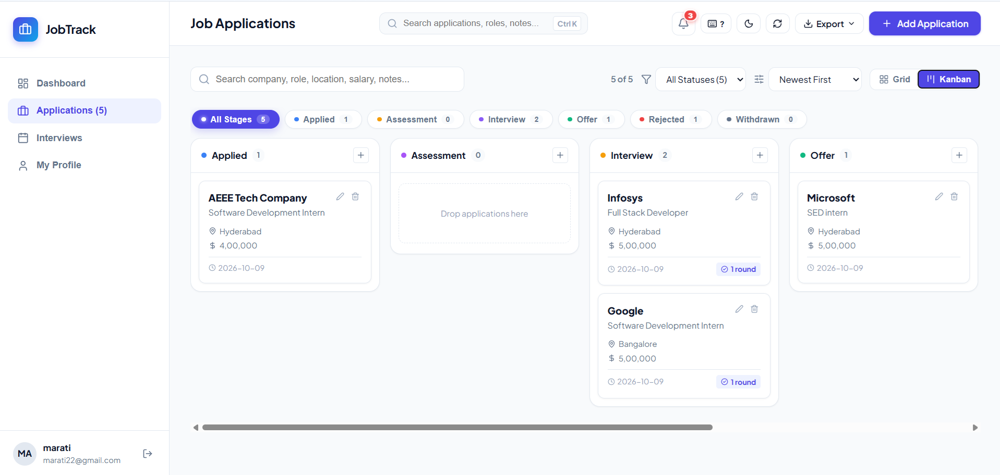
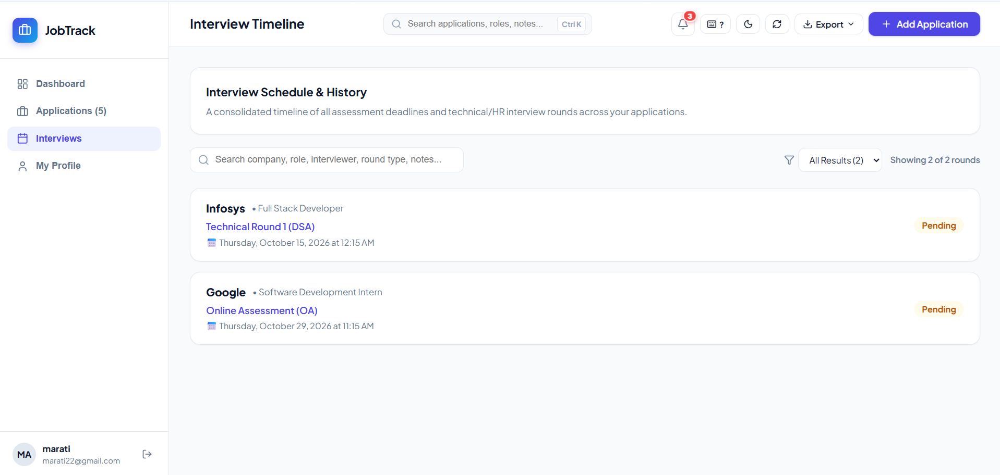

# 🎯 JobTrack — Production Job Application Tracker

[](https://frontend-six-henna-96.vercel.app)  
**Live Demo:** [https://frontend-six-henna-96.vercel.app](https://frontend-six-henna-96.vercel.app)

A modern, full-stack application designed to streamline job hunting, interview tracking, and conversion analytics for engineers and students. Built with **React + Vite**, **FastAPI**, **SQLAlchemy**, **SQLite/PostgreSQL**, and **JWT Authentication**.

---

## 🌟 Key Features

### 1. 📊 Real-Time Dashboard & Recruitment Funnel
- **Conversion Metrics**: Real-time pass-through metrics (Interview Conversion %, Offer Rate %, Rejection Rate %).
- **Interactive Recruitment Funnel**: Multi-stage progress tracking from *Applications Sent* &rarr; *Assessments Cleared* &rarr; *Technical Rounds* &rarr; *Offers Secured*.
- **Geographic Hubs & Insights**: Visual distribution of target hiring hubs and average rounds per application.

### 2. 🗂️ Dual View Mode: Grid & Kanban Board
- **Drag-and-Drop Kanban Board**: 6 pipeline columns (*Applied*, *Assessment*, *Interview*, *Offer*, *Rejected*, *Withdrawn*) with native drag-and-drop status transitions.
- **Card Grid View**: Sortable by date or company, filterable by stage, and searchable across company, role, or location.

### 3. 📅 Round-by-Round Interview Pipeline
- Track Online Assessments (OAs), Technical Rounds (DSA & System Design), Managerial, and HR screens.
- Record interviewers, scheduled dates, notes, and results (*Pending*, *Passed*, *Failed*, *Cancelled*).
- Cascade deletion: Deleting an application cleans up all corresponding interview rounds.

### 4. 🌓 Dark / Light Mode & Modern Aesthetics
- Instant theme toggle persisted in `localStorage`.
- Glassmorphism header, smooth micro-interactions, and status glow indicators.
- Responsive design tailored for desktops and mobile viewports.

### 5. 💾 Data Portability (Export & Backup)
- **Export as CSV**: Generates formatted spreadsheet with all job fields and round counts.
- **Export as JSON**: Full data backup including nested interview histories.
- **Backend CSV Stream**: Direct `/applications/export/csv` streaming endpoint.

### 6. 🔐 JWT Authentication
- Secure registration and login with `bcrypt` password hashing and signed JWT tokens (`HS256`).
- Protected API routes and token authentication.

---

## 📸 Screenshots

| 📊 Dashboard & Recruitment Funnel |
|:---:|
|  |

| 🗂️ Kanban Board (Dual View) |
|:---:|
|  |

| 📅 Interview Timeline & Round Tracking |
|:---:|
|  |

---

## 🏗️ Architecture & Tech Stack

```
Job Application Tracker/
├── backend/
│   ├── app/
│   │   ├── models/         # SQLAlchemy ORM entities (User, Application, Interview)
│   │   ├── schemas/        # Pydantic v2 validation models
│   │   ├── routes/         # FastAPI Routers (auth, applications, interviews, dashboard)
│   │   ├── services/       # Auth, bcrypt hashing, and JWT token dependencies
│   │   ├── config.py       # Pydantic settings & environment configuration
│   │   ├── database.py     # Database engine & session management
│   │   ├── seed.py         # Initial sample seed data
│   │   └── main.py         # FastAPI application entrypoint
│   ├── tests/              # 13 Automated Pytest integration tests
│   ├── vercel.json         # Standalone Vercel backend routing
│   └── requirements.txt    # Python dependencies
├── frontend/
│   ├── src/
│   │   ├── components/     # ApplicationCard, KanbanBoard, AnalyticsCharts, Modals
│   │   ├── services/       # API client layer (api.js)
│   │   ├── utils/          # Data export helpers (exportUtils.js)
│   │   ├── App.jsx         # Main application container
│   │   ├── App.css         # Component styling & animations
│   │   └── index.css       # Design tokens & dark/light theme CSS variables
│   └── package.json
├── screenshots/            # Application UI screenshots
└── vercel.json             # Root monorepo Vercel routing
```

---

## 🚀 Getting Started

### Prerequisites
- Python 3.10+
- Node.js 18+

### 1. Backend Setup (FastAPI)
```bash
# Activate virtual environment
.\venv\Scripts\activate   # Windows
source venv/bin/activate  # macOS / Linux

# Navigate to backend directory and start server
cd backend
python -m uvicorn app.main:app --host 127.0.0.1 --port 8000 --reload
```
> *Alternatively, from the repository root:*
> ```bash
> python -m uvicorn app.main:app --app-dir backend --host 127.0.0.1 --port 8000 --reload
> ```

API Documentation will be available at:
- **Swagger UI**: [http://127.0.0.1:8000/docs](http://127.0.0.1:8000/docs)
- **ReDoc**: [http://127.0.0.1:8000/redoc](http://127.0.0.1:8000/redoc)

### 2. Frontend Setup (React + Vite)
```bash
cd frontend
npm install
npm run dev
```
Open [http://127.0.0.1:5173](http://127.0.0.1:5173) in your browser.

---

## 🧪 Running Automated Tests

Run the complete 13-test test suite:
```bash
python -m pytest backend/tests -v
```

All 13 tests cover:
- User registration, duplicate checks, login, and profile lookups
- Application CRUD, search, status filtering, and sorting
- CSV export streaming
- Round-by-round interview logging and cascade deletion
- Real-time dashboard metric calculation

